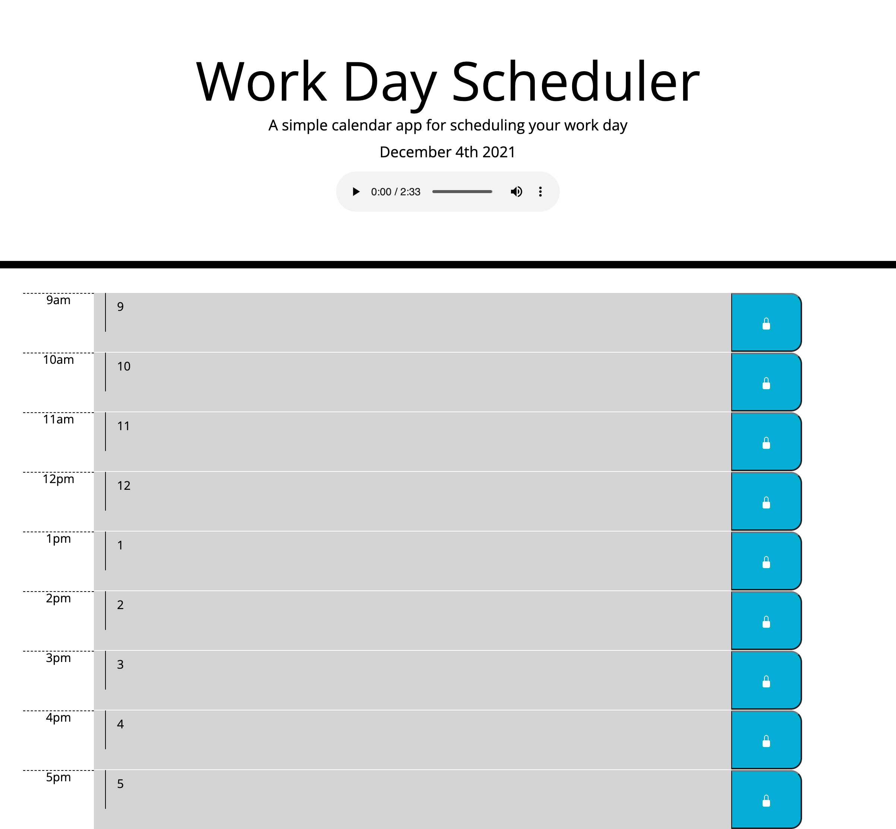

# Work Day Scheduler
  
  

## Summary

Simple calendar application that allows a user to save events for each hour of the day. This app runs in the browser and features dynamically updated HTML and CSS powered by jQuery.

## Deployment
https://katiechurchwell.github.io/work-day-scheduler/Develop/index.html

## Screenshot

## Questions
  If you have any questions about this project, please open an issue or use the contact information below:
  * [katiechurchwell](https://www.github.com/katiechurchwell)
  * [churchwellcatherine@gmail.com](mailto:churchwellcatherine@gmail.com)

---
  